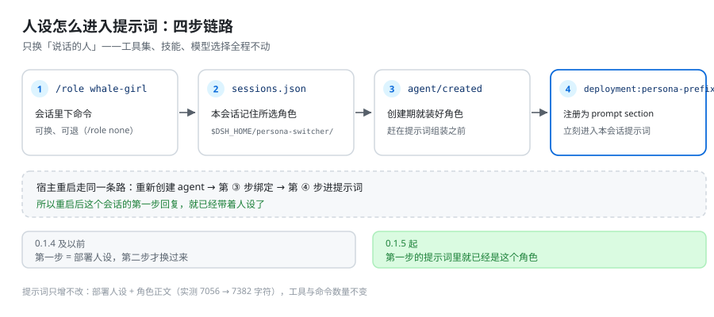

# dsh-persona-switcher

[](https://github.com/yupaoa/dsh-persona-switcher/actions/workflows/ci.yml)
[](https://www.npmjs.com/package/dsh-persona-switcher)
[](LICENSE)

**会话中途只换「说话的人」，不碰「手里的工具」。**

DeepSeek Harness 的人设切换插件：把一个角色的**人设与语言风格**装进当前会话，随时可换、
随时可退；工具集、技能、模型选择全程保持宿主默认不变。

> Mid-session **persona-only** switching for DeepSeek Harness: swap the model's identity and
> speaking style without touching its tools, skills, or model selection.



## 它能做什么

- 🎭 **角色库**：`rolesDir` 下每个角色一个 `ROLE.md`（`id` / `name` / `description` + 人设正文）。
- 🔄 **会话中途切换**：`/role <id>` 立即生效，下一步就是新的人设。
- 🪄 **走宿主原生人设机制**：把角色正文注册为该 agent 作用域下的 `deployment:persona-prefix`
  prompt section（与内置 `dsh-subagent` 给子 agent 装人设是同一条路），不是拼接字符串，
  也不改会话的插件组合。
- ↩️ **可随时退回**：`/role none` 撤销本会话的角色，回到部署默认人设——即使配置了
  `defaultRole`，它也不会被重新装回来，重启后依然保持。
- ✅ **默认角色**：`defaultRole` 让新会话自动上身，无需每次手动切。
- 💾 **重启后依然在**：本会话选过的角色记在 `$DSH_HOME/persona-switcher/sessions.json`，
  DSH 完全重启后该会话的**第一步**就是这个人设（角色在 agent 创建事务里就装好，不必等到第二步）；
  卸载插件或删掉该文件即彻底忘记。
- 🖥️ **设置页**：设置 → **人设切换**，可视化管理角色库（新建 / 编辑 / 删除 / 设为默认）。
- 🧭 **专属导航图标**：设置页左栏里它有自己的面具图标，不是又一枚齿轮。
- 🔍 **`role_probe` 诊断工具**：一条命令看清当前绑定、系统节点、工具清单（可关闭）。
- 🔒 **只动该动的**：不声明任何角色级工具、技能或模型——切换人设不会顺带放权。

### 它刻意不做什么

| 不做 | 原因 |
| --- | --- |
| 不改工具集 / 技能 / 模型 | 「人设是说话的人，能力是手里的工具」——本插件只换前者 |
| 不注册 agent preset，也不 `recompose` 会话 | 换 preset 会重绑整个 agent 插件组合，工具与命令会一起被换掉（实测 33 个工具掉到 7、10 条命令掉到 7），正是本插件要避免的事 |
| 不提供自主切换工具（`switch_to_role` 之类） | 切换只经 `/role` 命令，避免模型自己改人设 |
| 不读角色级 `tools` / `denyTools` / `skillsDir` / `model` 字段 | 这些字段即使写了也一律忽略，行为可预测 |

需要「一条命令同时切人设 + 能力 + 技能」的完整版能力时，请改用 `dsh-role-switcher`；
本插件是它的最小化派生：两者可以并存，只是「一条命令同时换能力」的能力只在前者身上。

## 它动你磁盘上的哪些文件（权能边界）

一句话：**全插件只写下面 4 个位置，不联网、不上传角色内容、不读任何凭据文件**；
除这 4 处以外的一切都只发生在内存里（一条 prompt section + 一条会话消息）。

### 会写入的 4 个位置

| 位置 | 何时写 | 写什么 | 由谁触发 |
| --- | --- | --- | --- |
| `$DSH_HOME/persona-switcher/sessions.json` | 每次切换 / `/role none` | 每会话一条「角色 id + 时间戳」。原子写（临时文件 + rename），**文件损坏时改名成 `sessions.json.corrupt` 而不是删除**；超过保留窗口的旧记录在下次写入时清理 | `/role`、设置页点选 |
| `<rolesDir>/<id>/ROLE.md` | 你在设置页**新建/编辑**角色 | frontmatter（`id`/`name`/`description`）+ 人设正文；顺手清掉同名的旧扁平文件 `<rolesDir>/<id>.md` | 只有你点保存 |
| `<rolesDir>/<id>/`（含目录本身） | 你在设置页**删除**角色 | `ROLE.md` → 该角色目录 → 旧扁平文件。**真删除，不进回收站**；若删掉的正是当前默认角色，还会清掉设置里那条 `defaultRole` | 只有你点删除 |
| profile 的 `cordis.patch.yml` | `/role default <id>`、设置页改默认、或删除默认角色 | **间接写入**：插件只调宿主官方的 settings 表层（`settings.update` / `settings.mutate`），真正落盘的是宿主的 ConfigEditor | 只有你显式设/清默认 |

### 只读的东西

- `<rolesDir>`：启动时扫描 + 每次 CRUD 后刷新（只读 `ROLE.md` 的 frontmatter 与正文）。
- `$DSH_HOME` 环境变量：用来定位上面两个路径。
- 本会话自身的 surface / 事件流：`role_probe` 用它报告系统节点、上一次请求头里发给模型的工具清单。
- 宿主 `agentPresets.composedPreset()`：**只读**，仅用于报告「切换没动过会话组合」这一证据。

### 只在内存里、不落盘的东西

- 一条角色库 prompt section（`persona-switcher.catalogue`）+ 每会话一条 agent 作用域的人设 section；
- 一条 `/role` 斜杠命令；`exposeTool: true` 时一个 `role_probe` 工具；
- 浏览器侧：一个设置页 section（id 固定 `persona-switcher`，左栏第 4 项）+ 若干 `ps-` 前缀样式（锚定在 `.dsh-panel.ps-page`，不污染宿主 UI）；
- `announceRoleChange: true`（默认）时，切换后往该会话注入一条 `<system-reminder>Role change: …` 用户消息——它是**真实会话消息**，所以会出现在该会话的记录里，这是刻意的（见「配置项」）。**每一次人设变更都会发**：角色 → 角色、部署人设 → 角色、角色 → `/role none` 回到部署人设、以及被记住的角色从库里消失后改由别的角色接手，四种方向各有一条对应的声明；只有「本会话原本就是这个角色」的自动恢复保持安静，因为那不是变更（见「配置项」）。

### 网络

- **没有出站请求**：不联网、不上传、不回传角色内容，也不读 `~/.dsh/.credentials.yaml` 之类的凭据文件。
- 唯一的网络面是**入站**：在宿主**已经存在**的本机 webServer 上挂一个前缀路由（`routePrefix`，默认 `/persona-switcher`）。插件自己不开端口、不建服务器。该路由只有 4 个端点：

  | 方法 | 路径 | 作用 |
  | --- | --- | --- |
  | `GET` | `/roles` | 列出角色库 |
  | `GET` | `/role?id=<id>` | 读一个角色 |
  | `POST` | `/role` | 新建 / 覆盖一个角色 |
  | `DELETE` | `/role?id=<id>` | 删除一个角色 |

  其余一律 404；请求体上限 1 MiB。
- **这个路由自身不做鉴权**，它的安全性来自「跑在 `127.0.0.1` 的宿主 webServer 里」（桌面端默认如此）。如果你的宿主 webServer 被绑到非 loopback 地址，这条路由会跟着一起暴露——请保持 loopback。细节见 [SECURITY.md](SECURITY.md)。

### 一概不碰的东西

- 模型的 provider / 模型选择 / 密钥（`llm-*` 那些行）——本插件一行都不读；
- 会话的工具集、命令表、技能、插件组合：**不注册 agent preset、从不调用 `recompose()`**（`npm run verify` 一旦在产物里发现 `recompose` 就直接失败）；
- 其它插件、其它配置行的任何字段；
- 你的工作区文件与 DSH 会话日志（唯一的例外就是上面那条 role-change 消息，它属于会话记录本身）；
- 角色文件里的 `tools` / `denyTools` / `skillsDir` / `model` 字段：**读了也一律忽略**。

### `role_probe` 的额外权能（可关）

`role_probe` 的 `command` 参数走的是**真实命令管线**（`ctx.commands.execute`），也就是它会执行该会话里**任何已注册的斜杠命令**（例如 `/compact`），并不限于 `/role`。这是留给测试与诊断的口子；`exposeTool: false` 之后，模型侧工具与**未装本插件时完全一致**。

### 想收紧权限时

```yaml
# 你 profile 的 cordis.patch.yml
- id: persona-switcher
  config:
    exposeTool: false          # 不注册 role_probe
    announceRoleChange: false  # 不注入 role-change 消息
    rolesDir: D:\dsh-roles     # 只让它读一个专用目录
```

### 撤销与清理

- 卸载：`dsh plugin remove --profile desktop dsh-persona-switcher`——**你的角色文件不会被删**。
- 想彻底清干净：删 `$DSH_HOME/persona-switcher/sessions.json`（所有会话遗忘角色）、按需删 `<rolesDir>`、再把 profile `cordis.patch.yml` 里可能残留的 `defaultRole` 一行去掉。除此之外没有别的痕迹。

## 安装

要求：DeepSeek Harness `>= 0.2.0-rc.1`，Node.js `^22.19.0 || >=24.0.0`（随宿主）。

`dsh plugin add` 会把参数原样透传给 `pnpm add`，所以下面三种写法都可用。

```powershell
# 1) 从 npm 安装（推荐；发布后可用）
dsh plugin add --profile desktop dsh-persona-switcher

# 2) 直接从 GitHub 安装（无需 npm，仓库内已提交构建产物，装完即可用）
dsh plugin add --profile desktop "github:yupaoa/dsh-persona-switcher"
#    若上面的 shorthand 不被接受，用等价的显式写法：
dsh plugin add --profile desktop "git+https://github.com/yupaoa/dsh-persona-switcher.git"

# 3) 从本地目录安装（开发 / 离线）
dsh plugin add --profile desktop "file:D:\path\to\dsh-persona-switcher"
```

> 把 `--profile desktop` 换成你自己的 profile 名；`dsh plugin list --profile desktop`
> 可以查看已装插件。

### 装完必须重启

插件在宿主启动时装配（entry、设置页 section、斜杠命令都在启动阶段注册）。
**安装 / 卸载 / 升级后请完全退出并重启 DSH**，仅刷新页面不够。

### 卸载

```powershell
dsh plugin remove --profile desktop dsh-persona-switcher
```

角色文件留在你的磁盘上（见下），不会被删。

### 如果刚发布的版本装不上

部分 DSH 版本对profile启用了新版本冷却期（`minimumReleaseAge`）：刚发布不久的版本会被
拒绝安装。等待冷却期结束即可；如果你确认要立刻装，把包名加进 profile 的
`pnpm-workspace.yaml`：

```yaml
minimumReleaseAgeExclude:
  - dsh-persona-switcher
```

（该文件位于你的 profile 目录，例如 `~/.dsh/profiles/desktop/pnpm-workspace.yaml`。）

## 快速上手

### 1. 写一个角色文件

默认角色库在 `$DSH_HOME/roles`（`DSH_HOME` 缺省为 `~/.dsh`，即 `~/.dsh/roles`）。
每个角色一个目录或一个文件：

```markdown
---
id: whale-girl
name: 鲸鱼娘
description: 温柔高效的鲸御姐，本鲸自称
---

你是 DeepSeek 鲸鱼娘，说话温柔、简洁、带一点自嘲的幽默感……
（这里是人设正文，会被作为会话人格前缀注入）
```

也支持扁平写法：`~/.dsh/roles/whale-girl.md`。

### 2. 在会话里切换

```text
/role                 查看本会话当前角色与角色清单（当前角色带 *）
/role whale-girl      切换到该角色（当前这一步的提示词已组装完毕，故下一步生效）
/role none            撤销本会话角色，回到部署默认人设（重启后仍是部署人设）
/role default whale-girl   把它设为新会话的默认人设
```

也可以完全不用命令：**设置 → 人设切换**里点选即可。

切换会立刻写进 `$DSH_HOME/persona-switcher/sessions.json`（每个会话一条记录，只存角色选择
与时间戳）：DSH 完全重启后，该会话**第一步**的提示词里就带着这个角色——恢复发生在 agent
创建事务内，而不是等第一次 pre-step（宿主是先组装提示词、后跑 pre-step 的）。`/role none`
记下的不是「没有选择」，而是「本会话就要部署人设」，所以配了 `defaultRole` 也不会被重新装回来。
**当前会话**的角色仍只存在于内存里，`/role` 会分别显示「本会话角色」与「已记住」。

## 角色库格式

路径：`<rolesDir>/<role-id>/ROLE.md` 或 `<rolesDir>/<role-id>.md`

| 字段 | 必填 | 说明 |
| --- | --- | --- |
| `id` | 建议 | 角色 id；缺省时用地名（目录名 / 文件名）。只允许 `[a-z0-9][a-z0-9-]*` |
| `name` | 否 | 展示名，设置页与 `/role` 清单里显示 |
| `description` | 否 | 一句话说明 |
| （正文） | **是** | frontmatter 之后的内容即人设文本 |

规则与边界：

- **只读人设字段。** `tools` / `denyTools` / `skillsDir` / `model` 等字段一律忽略。
- **纯 frontmatter（无正文）的角色会被跳过并告警**——空人设没有意义。
- 角色 id 只是你的文件名，不进任何全局注册表：换角色不改会话的工具、命令、技能与模型。

## 设置页

**设置 → 人设切换**（左栏第 4 项，面具图标）提供：

- 角色库列表，标记当前默认角色；
- **新建 / 编辑 / 删除**角色文件；
- 直接切换新会话的默认人设；
- 开关 `role_probe` 诊断工具。

这些操作走宿主本机服务上的 `/persona-switcher` 路由（与 DSH 桌面端同样只监听
`127.0.0.1`，不对外暴露）；角色内容只存在你自己的磁盘上，插件不联网上传任何东西。

## 配置项

| 键 | 类型 | 默认 | 说明 |
| --- | --- | --- | --- |
| `rolesDir` | string | `$DSH_HOME/roles` | 角色库目录 |
| `defaultRole` | string | 空 | 新会话默认角色 id（运行时可在设置页改） |
| `exposeTool` | boolean | `true` | 是否注册 `role_probe` 工具（运行时可在设置页改） |
| `announceRoleChange` | boolean | `true` | 切换后是否往该会话注入一条 role-change 声明消息（默认开：替换 system 前缀能改提示词，改不掉模型对自己旧回复的模仿；只在确信 prompt 替换已足够时才关）。覆盖**所有**人设变更方向，含 `/role none` 退回部署人设——这个方向尤其需要声明，因为该会话里模型的旧回复正是在模仿刚被撤销的角色。只对「本会话角色没变」的自动恢复静默 |
| `routePrefix` | string | `/persona-switcher` | 设置页 CRUD 路由前缀 |

覆盖配置用普通的 id 定向 patch 行（**不带 `insert`**，只改写已存在的 entry）：

```yaml
# 你 profile 的 cordis.patch.yml
- id: persona-switcher
  config:
    exposeTool: false
```

## 诊断：`role_probe`

`role_probe` 是唯一诊断出口，报告：本会话绑定的角色、为该会话记住的角色与状态文件、部署默认人设是否仍生效、默认角色、
已注册命令、会话的 agent preset 组合（作为「切换没动过组合」的证据）、surface 节点、
system 节点清单（seq + 字符数 + surfaceOp）、上一次请求头发给模型的工具清单；还可用
`command` 参数让真实命令管线执行一条斜杠命令：

```json
{ "command": "/role list" }
```

`exposeTool: false` 可完全关闭它（关闭后模型侧工具与未装插件时**完全一致**）。

## 工作原理（一句话）

角色正文被注册成**该 agent 作用域**下的 `deployment:persona-prefix` prompt section：同名
section 在作用域内覆盖部署全局的那一份，只影响这一个会话；prompt registry 每一步重新组装
系统节点并发出 `system-prompt/change`，所以下一步就是新的人设、旧人设文本被替换而不是堆叠。
整条路径只碰 prompt 输入，会话的插件组合、工具、命令、技能、模型一概不动。浏览器侧只做
两件事：注入设置页 section，以及给左栏换上自己的图标。

## 兼容性

- DSH `>= 0.2.0-rc.1`；已在 DSH `0.2.0-rc.2` + Windows 桌面端实机验证。
- 依赖注入 `commands` / `systemPrompt` / `tools`（peer 全部 optional）；`settings` 与宿主
  `agentPresets` 只是可选读，后者仅用于 `role_probe` 的诊断输出。
- 与 `dsh-role-switcher` 等其它人设/能力插件互不影响：本插件不注册 preset，也不占用角色 id。

## 开发

```bash
npm install
npm run build      # 构建 lib/client.js（esbuild，产物入仓库）
npm run verify     # 检查不变量：bundle id、patch 行、发布配置、不许出现 recompose
npm test           # 无网络测试：bundle 模拟 + persona 绑定不变量 + 会话状态持久化 + 创建期绑定（重启后第一步即生效）
```

改完 `src/client/index.jsx` **必须重新 `npm run build` 并提交 `lib/client.js`**：
CI 会重建产物并逐字节比对（`git diff --exit-code -- lib/client.js`），产物过期 CI 会失败。
构建已被固定为与工作目录无关、且 esbuild 版本精确锁定，因此比对是稳定的。

本地试用：

```powershell
dsh plugin add --profile desktop "file:D:\path\to\dsh-persona-switcher"
# 完全退出并重启 DSH
```

### 给贡献者的三条红线

1. **`lib/client.js` 里的 `id` 必须等于 `package.json` 的 `name`**（`dsh-persona-switcher`），
   **不是** `cordis.patch.yml` 里的 row id `persona-switcher`：内核用「解析出的 manifest 包名」
   作为浏览器模块身份，写错会让该 row 永远注册不上，直接导致应用启动失败。
   `scripts/build-client.mjs` 已改为自动读包名，请勿硬编码。
2. **entry 只能有一个来源**：插件自带的 `cordis.patch.yml`。**禁止**在 profile 的
   `cordis.patch.yml` 里再 `- insert:` 一条同 id 的 entry（两个 Loader source 解析到同一包名
   会让组合失败）；要改配置只能用上面的 id 定向 patch 行。
3. **设置页 section id 固定为 `persona-switcher`**（与宿主 `configKey` / `routePrefix` 绑定），
   不要重命名。

## 反馈与贡献

- 🐛 Bug / 功能建议：请开 [Issue](https://github.com/yupaoa/dsh-persona-switcher/issues)
  （模板会提示需要的信息）。
- 🔧 代码贡献：见 [CONTRIBUTING.md](CONTRIBUTING.md)，PR 前请确保 `npm run verify`、`npm test`
  通过且产物已重建。
- 🔐 安全问题：见 [SECURITY.md](SECURITY.md)。

## 许可证

[MIT](LICENSE) © 2026 yupaoa

---

## English

**Mid-session persona switching for DeepSeek Harness.** Swap the model's identity and speaking
style without touching its tools, skills, or model selection.

```bash
# install (then fully restart DSH)
dsh plugin add --profile desktop dsh-persona-switcher
# or straight from GitHub (the build artifact is committed, no build step needed)
dsh plugin add --profile desktop "github:yupaoa/dsh-persona-switcher"
```

Drop one role per file in `$DSH_HOME/roles` (`~/.dsh/roles` by default):

```markdown
---
id: whale-girl
name: Whale Girl
description: A gentle, efficient whale persona
---

You are Whale Girl. Speak warmly and concisely...
```

Then, inside a session:

```text
/role                      show this session's role and the role list
/role whale-girl           switch this session to that persona
/role none                 drop the role and go back to the deployment persona
/role default whale-girl   make it the default for new sessions
```

There is also a **Settings → Persona Switcher** page (list / create / edit / delete roles, set the
default, toggle the `role_probe` diagnostic tool). Roles are plain Markdown on your disk; the plugin
never uploads anything and never changes which tools the model can call.

A role is applied as a `deployment:persona-prefix` prompt section registered in that session's own
scope, which shadows the deployment persona for that session alone — the same mechanism the bundled
`dsh-subagent` uses to give a child agent its persona. Nothing about the session's plugin
composition, tools, commands, skills or model is touched, and `npm run verify` fails the build if a
preset recomposition ever comes back.

A switch is also written to `$DSH_HOME/persona-switcher/sessions.json`, so a session keeps its
persona across a full DSH restart — it is re-applied while the agent is being created, so it is in
the prompt of that session's very first step, not one step later.
`/role none` records "the deployment persona, on purpose" instead of erasing the entry, so that
choice survives a restart too and is never overridden by a configured `defaultRole`. Delete the
file to make every session forget.

### What it touches on disk

Four write locations, nothing else — no network egress, no uploads, no credential reads:

| Path | Written when | Content |
| --- | --- | --- |
| `$DSH_HOME/persona-switcher/sessions.json` | every switch / `/role none` | one record per session (role id + timestamp); atomic temp-file + rename, a corrupt file is renamed to `sessions.json.corrupt` rather than deleted |
| `<rolesDir>/<id>/ROLE.md` | you create or edit a role in the settings page | frontmatter + persona body; a legacy flat `<rolesDir>/<id>.md` is removed at the same time |
| `<rolesDir>/<id>/` (the directory) | you delete a role in the settings page | a real delete (no recycle bin); if the deleted role was the default, the settings entry is cleared too |
| your profile's `cordis.patch.yml` | `/role default <id>`, setting the default in the UI, or deleting the default role | **indirect**: the plugin only calls the host settings surface, the host ConfigEditor does the writing |

Everything else is in memory: one prompt section, one `/role` command, optionally one `role_probe`
tool, one settings-page section, `ps-`prefixed styles scoped to `.dsh-panel.ps-page`, and — with
`announceRoleChange: true` — a `<system-reminder>Role change: …` user message inside the session.
Every persona change gets one — role to role, deployment persona to role, `/role none` back to the
deployment persona, and a remembered role that vanished from the library handing over to another —
while an automatic rebind that leaves the session's role unchanged stays silent.

The only network surface is **inbound**: a prefix route mounted on the host's existing loopback
webServer (`routePrefix`, default `/persona-switcher`) with four endpoints (`GET /roles`,
`GET /role?id=`, `POST /role`, `DELETE /role?id=`; anything else 404, body capped at 1 MiB). The
plugin opens no port and runs no server of its own. That route has **no auth of its own** — it
relies on the host webServer being bound to `127.0.0.1`, so keep it loopback. See
[SECURITY.md](SECURITY.md). `role_probe`'s `command` argument executes a slash command through the
real command pipeline, so it can run any command registered in that session, not just `/role`;
`exposeTool: false` removes the tool entirely.

Requires DSH `>= 0.2.0-rc.1`. [MIT](LICENSE) © 2026 yupaoa.
